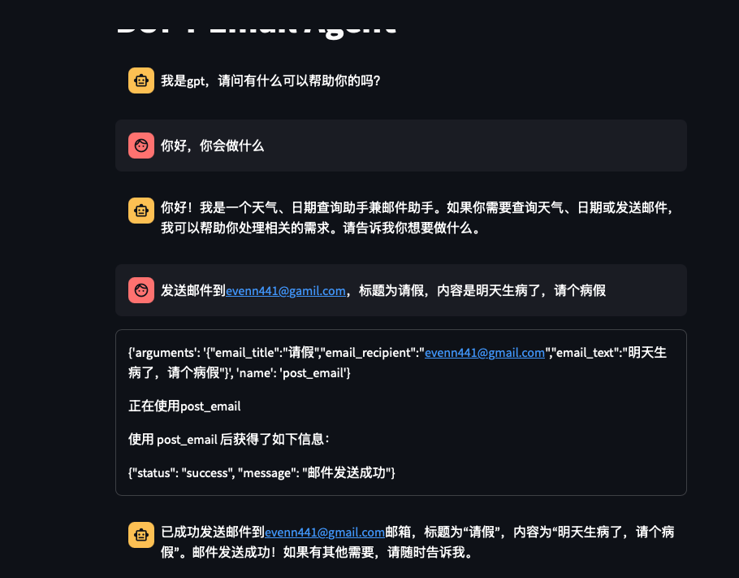
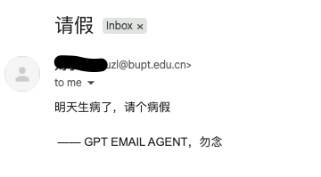

# 北邮教育邮箱email agent

一个使用北邮教育邮箱作为发件人的邮件代理。它可以通过 Streamlit 运行，并在本地服务器上进行访问。

## 启动方式

1. 克隆地址：
   ```bash
   git clone https://github.com/even-ai596/post_email_agent.git
   cd post_email_agent
   ```

2. 安装依赖：
   ```bash
   conda create -n email_agent python=3.13
   conda activate email_agent
   pip install -r requirements.txt
   ```

3. 复制环境变量模板，加入OPENAI_API_KEY、OPENAI_MODEL、OPENAI_BASE_URL、BUPT_EMAIL_USERNAME、BUPT_EMAIL_PASSWORD：
   ```bash
   cp .env_template .env
   ```

4. 安装 Playwright：
   ```bash
   playwright install
   ```

5. 运行项目：
   ```bash
   streamlit run main.py
   ```

6. 访问项目：
   在浏览器中打开 `localhost:8501` 以访问应用程序。








